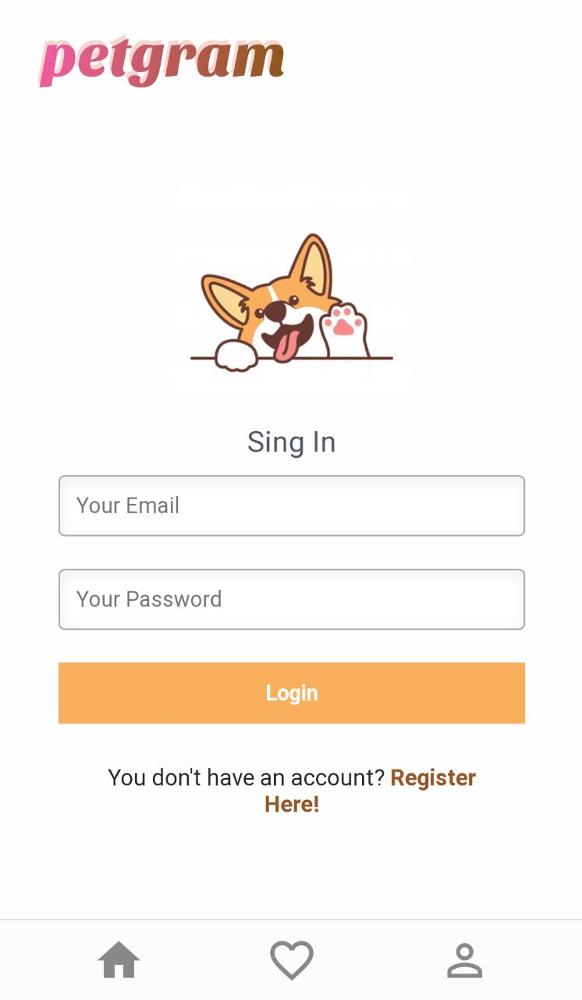

# Petgram (react avanzado)

Red social solo para mascotas.





React es una biblioteca de JavaScript para construir interfaces de usuario. Es declarativo, basado en componentes y puedes escribir una vez y usarlo donde sea.

# Styled Components

<https://styled-components.com/docs>

Los styled-components es una biblioteca para CSS-in-JS. Está basado en los CSS modules, una forma de escribir CSS que se enfoca el que el alcance de los estilos funcione por componente y no se filtren a ningún otro elemento de la página y al mismo tiempo que definimos sus estilos, podemos también condicionarlos a las propiedades que queramos.

Nota: en styled components escribes CSS exacto, así que prácticamente todo lo que puedes hacer en CSS lo puedes hacer en styled components.
<https://codesandbox.io/embed/controlled-form-with-render-props-xvil0?expanddevtools=1&fontsize=14&hidenavigation=1&module=%2Fsrc%2FApp.js&theme=dark&ref=hackernoon.com>

# Hooks

<https://es.reactjs.org/docs/hooks-intro.html>

Podemos resumirlos como funciones que nos permiten acceder a casi todas las caracteristicas de react desde componentes funcionales.

- useState
  It declares a “state variable…This is a way to “preserve” some values between the function calls — useState is a new way to use the exact same capabilities that this.state provides in a class. Normally, variables “disappear” when the function exits but state variables are preserved by React.
  <https://reactjs.org/docs/hooks-state.html>

- useEffect
  If you’re familiar with React class lifecycle methods, you can think of useEffect Hook as componentDidMount, componentDidUpdate, and componentWillUnmount combined.
  <https://reactjs.org/docs/hooks-effect.html>

- useContext
  In a typical React application, data is passed top-down (parent to child) via props, but this can be cumbersome for certain types of props (e.g. locale preference, UI theme) that are required by many components within an application. Context provides a way to share values like these between components without having to explicitly pass a prop through every level of the tree.
  <https://reactjs.org/docs/context.html>

# GraphQL Apollo

<https://graphql.org/learn/>

GraphQL es un lenguaje de consulta y un tiempo de ejecución del servidor para las interfaces de programación de aplicaciones (API); su función es brindar a los clientes exactamente los datos que solicitan y nada más. Imaginemos que tenemos una REST API con WordPress, nos entrega un JSON con mucha data innecesaria y solo queremos unos cuantos campos; GraphQL hace posible obtener únicamente esa data :) .

<https://www.apollographql.com/docs/react/get-started/>

React Apollo es un cliente que nos va a permitir conectarnos a un servidor GraphQL.

# Context

<https://es.reactjs.org/docs/context.html>

Context API es una característica que tiene React para poder pasar datos en nuestra aplicación sin necesidad de usar las Props.

Para crear un contexto vamos a importar el método createContext de la librería React. El contexto que creemos no va a dejar de ser un componente de React (por ello debe llevar mayúscula al inicio.)

El Context que creemos nos va a proporcionar 2 componentes:

- Provider: componente que debe envolver a nuestra aplicación.
- Consumer: nos va a permitir acceder a las render props que declaremos en el Provider.

# Render Props

<https://es.reactjs.org/docs/render-props.html#gatsby-focus-wrapper>

La técnica de render props está basada en la propiedad children de los componentes de react, envés de renderizar un componente hijo en el componente padre, renderizas una función que devuelve un componente, a la función le pasas como parámetros los objetos que desees (puede ser un fetching de base de datos como lo vimos en esta clase) y puedes acceder a la información como si ya la tuvieras a la hora de montar el componente padre con un hijo de una función.

En otras palabras Render props es un patrón utilizado en React que consiste en delegar lo que un componente va a "renderear" a otro componente, la mayoría de la veces, a un padre en el árbol de componentes.

En general usamos render props cuando queremos dar la mayor libertad posible al consumidor de nuestro componente de definir qué es lo que va a renderear, sin atarlo necesariamente a un template específico

## Ejemplo

1- Primero creamos un componente que haga toda la lógica del fetching de datos y regrese una función:

```
const GetPokemon = ({ children, pokemonNumber }) => {
  const [pokemon, setPokemon] = useState([]);
  useEffect(() => {
    window.fetch(`https://pokeapi.co/api/v2/pokemon/${pokemonNumber}/`)
      .then((res) => res.json())
      .then((myPokemon) => {
        setPokemon({
          src: myPokemon.sprites.front_default,
          name: myPokemon.species.name,
          id: myPokemon.id,
        });
      })
      .catch((error) => { console.error(error); });
  }, []);
  return ( // acá toda hacer un return del children como función
    <div>
      {children(
        { pokemon }, // en los argumentos dejamos la información que queramos que sea accesible para otros componentes
      )}
    </div>
  );
};
```

2- Después ya podemos acceder a la data del componente al invocarlo y pasar en el children una función con el mismo argumento que fue declarada:

```
<GetPokemon
 pokemonNumber={key + 1}
 key={key + 1}
>
 {
   ({ pokemon = {} }) => (
     <Pokemon
       src={pokemon.src}
       pokemonName={pokemon.name}
       pokemonNumber={pokemon.id}
       key={key + 1}
     />
   )
 }
</GetPokemon>
```

# Reach Router

<https://reach.tech/router/>

Reach Router es una versión simplificada y mejor optimizada de React Router, su creador es Ryan Florence el mismo creador de React Router. Se anunció que los dos paquetes se iban a unir, pero su API se va a parecer más a Reach Router.

# React Helmet

# React Memo

La React memo se usa principalmente para aumentar la velocidad de renderizado mientras disminuye las operaciones de renderizado, almacenar en caché el render()resultado de un componente en un ciclo de renderizado inicial y reutilizarlo dadas las mismas entradas (props, estado, propiedades de clase, variables de función) .

Para evitar que estas render() operations se repitan y generen un resultado idéntico, podemos almacenar en caché el resultado de la inicial render()y hacer referencia a ese resultado en la memoria la próxima vez que se procese un componente.

Para componentes de clase tenemos _React.PureComponent_ una optimización del rendimiento, que implementa el componentShouldUdpdate() método del ciclo de vida para comparar accesorios poco profundos y comparación de estado del render anterior. Si coinciden, el componente no se volverá a renderizar.

```
export class MyComponent extends React.PureComponent {
   ...
}
```

Para replicar este comportamiento en componentes funcionales, React introdujo la React.memoAPI, un componente de orden superior que implementa la misma comparación superficial en los props para determinar si se procesará una nueva renderización.

React.memo también nos da la opción de proporcionar nuestra propia función de comparación como un segundo argumento para la API, lo que nos brinda más granularidad para determinar si se necesita una actualización.

```
export const Home = React.memo(HomePage, (prevProps, props) => {
  console.log('Render: Home Memo')
  return prevProps.id === props.id
})

```


# React Lazy - Suspense

<https://es.reactjs.org/docs/code-splitting.html>
Suspense es un componente de React que nos va a permitir suspender algo cuando está en modo lazy(); y lazy(). El cual nos va a permitir importar un componente que no será cargado hasta que este sea llamado osea carga on-demand. De esta forma mejoraremos el tiempo de carga de nuestra aplicación enormemente.

Para SSR debemos utilizar otra libreria <https://github.com/gregberge/loadable-components>

# Props Types

<https://reactjs.org/docs/typechecking-with-proptypes.html#gatsby-focus-wrapper>
<https://github.com/facebook/prop-types>
Las PropTypes serán un validador del tipo de datos que estamos recibiendo como props en nuestros componentes

# PWA

## Manifest (add to home)

<https://github.com/arthurbergmz/webpack-pwa-manifest#readme>

## Workbox (service worker)

<https://developers.google.com/web/tools/workbox/modules/workbox-webpack-plugin>
<https://medium.com/twostoryrobot/a-recipe-for-offline-support-in-react-apollo-571ad7e6f7f4>
Utilizamos workbox-webpack-plugin para agregar soporte online a nuestro proyecto, así como lo hacen Twitter e Instagram cuando entramos desde el navegador.

# Articulos Interesantes

<https://medium.com/simply/comparison-hocs-vs-render-props-vs-hooks-55f9ffcd5dc6>

## Licencia 📄

MIT

## Conceptos Aprendidos 🤓

- <https://platzi.com/cursos/react-avanzado/>

## Certificado

- [Diploma](./readme-static/diploma-react-avanzado.pdf)

---

👩‍💻 with ❤️ by [silnose](https://github.com/silnose) 😊
